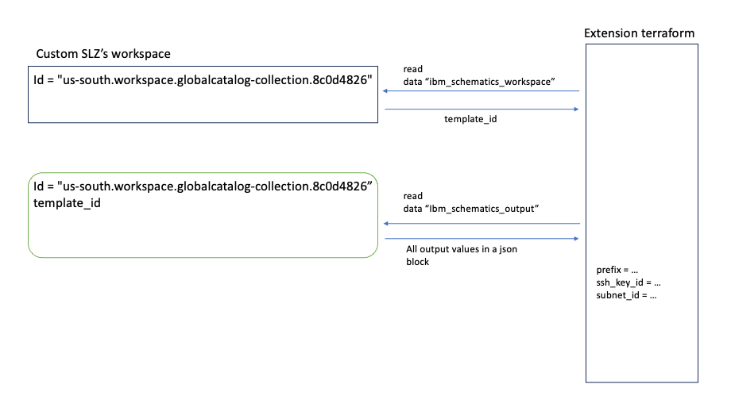

# Extending a deployable architecture

This tutorial customizes an existing deployable architecture with an extension that deploys a virtual server that is running an Apache webserver.  This is to illustrate deploying a simple workload(Apache webserver) into an existing 
landscape.  

Key points of this scenario are as follows:
1.  a deployable architecture is deployed as a dependency.  It provides a basis for additional building blocks to be deployed.
2.  an "extension" deployable architecture deploys a workload onto the dependent landscape.
3.  the extension illustrates how a technology like Ansible might be used in conjunction with terraform to deploy an application, in this case Apache webserver.

Illustrated here are simple practices for developing the deployable architectures that will allow an extension to leverage a dependency.

A design point for the extension is that it is to be implemented such that it requires minimal inputs from the consumer and that it integrates with its dependency.  More specifically with this example, it is desired that the 
Apache webserver workload virtual server be deployed within a virtual private cloud (VPC) created by the Custom SLZ.  Doing requires specific information such as the id of the VPC, information about its subnets, an ssh key, etc.  
Additionally, the resources deployed by Custom SLZ used a string prefix so that the names of the deployed resources would be named similiarly.  They are also in the same resource group.  It is desireable that any new resources 
deployed on the Custom SLZ landscape follow the same naming conventions and use the same resource group.

Much of the information mentioned so far has already been given to the Custom SLZ deployment.  It just needs to be made available to an extension.  The way to do this is for the Custom SLZ deployable architecture to 
enable extensions by recording information for later use by using the terraform output directive.  Output values are then emitted and saved in the IBM Cloud Schematics workspace.  The extension is implemented with 
code that reads the workspace and retrieves the values.  With this technique, the two parts are deployed separately and as long as the workspace from the deployment of the Custom SLZ deployable architecture is still 
accessible, then this works.  In a different tutorial additional methods will be illustrated.




Its important to note that the developer of the base deployable architecture has used the terraform output directive to emitt any potentially useful, non-sensitive data values.  This would include any of its own 
input parameters such as a prefix value or a name value, for example, but would also include information about the resources it has created.  Specifically what is needed are the id values assigned by the IBM Cloud. 
Id values are particularily useful as they are typically needed as input values in order to provision additional resources.  For example an ssh key id, not the name of the key, is needed when provisioning
a virtual server image.  Having the provisioned resources' id values in the accessible output means we can retrieve almost all of the data in one operation rather than several resource read operations via the terraform provider.

# Utilizing output from the dependent landscape

Below is an example of the full set of output values that are emitted from the deployment of the dependent base layer.  The output is decoded json.  To get the output from an IBM Schematics 
workspace utilize the `ibm_schematics_workspace` and the `ibm_schematics_output` resources.

```
data "ibm_schematics_workspace" "schematics_workspace" {
  workspace_id = var.prerequisite_workspace_id
  location     = local.location
}

data "ibm_schematics_output" "schematics_output" {
  workspace_id = var.prerequisite_workspace_id
  location     = local.location
  template_id  = data.ibm_schematics_workspace.schematics_workspace.runtime_data[0].id
}

workspace_outputs = jsondecode(data.ibm_schematics_output.schematics_output.output_json)
```


When accessing one of the output values, its important to note 
whether or not the value is an entry within an array, list, map or a simple value.  All of the data within the decoded output is a list where each output has a property of a `type` and a `value`.  Using the example 
below, if we wanted to access the value for the `prefix`, then we just need to get the `value` property's value so access it by 
```
prefix.value
```
but also add the location of the all of the outputs which is the `workspace_outputs` array.  The complete way to access the value of the `prefix` is 
```
workspace_outputs[0].prefix.value
```

Looking at a slightly more complicated example, look at retrieving the value of the `resource_group_data` output.  Specifically we are interested in the resource group's id.  The value is a map where the key is 
the resource group's name and key's value is the resource group id.  Terraform provides the function `values` to assist with doing that.  This is done like this
```
resource_group_data.value <-- which is a list and we want the first entry
(resource_group_data.value)[0]  <-- add in the workspace_outputs
values((workspace_outputs[0].resource_group_data).value)[0]
```

# Writing the terraform code

Time to write some code.  The general flow of this extension is this:
1.  connect to the Schematics workspace used to deploy the Custom SLZ and read the outputs
2.  retrieve values from the output
    1. prefix - so that we can name our resources with the same naming convention.
    2. subnet name within the target VPC where the webserver will be deployed.
    3. ssh key id of the public ssh key created by Custom SLZ - will need ssh enabled for Ansible.
    4. resource group id of the resource group used by the Custom SLZ so that our resources will be in the same group.
    5. floating ip address created by the Custom SLZ - this is our gateway into the VPC.
3.  query certain existing resources created by Custom SLZ to get additional information
4.  using the IBM terraform VSI module deploy a virtual server.
5.  use Ansible to deploy the Apache webserver package onto the virtual server.   

### Connect to Schematics workspace

As shown above, to connect to the a Schematics workspace the workspace id is needed and the Schematics service location where the workspace resides.  The location is part of the workspace id so it may be 
derived from it such as 

`location = regex("^[a-z/-]+", var.prerequisite_workspace_id )`

The location value in conjunction with the workspace id are used to query the resource type `ibm_schematics_workspace`.  Use the workspace query to obtain the workspace outputs in json form as shown in the detail above.

### Retrieve values from the output

Refer to the methods illustrated above for getting values from the `workspace_outputs` local variable.  Specifically to obtain the values `prefix, subnet_name, ssh_key_id, resource_group_id, fp_vsi_floating_ip_address` the 
folllowing does this.

```
locals {
  # access the output from the workspace which is in json format so decode the json.  This will then allow us to retrieve specific values.
  workspace_outputs = jsondecode(data.ibm_schematics_output.schematics_output.output_json)
  workspace_output = local.workspace_outputs[0]

  # refer to the structure of the output below to better understand how these values are retrieved.
  prefix      = local.workspace_output.prefix.value
  subnet_name = (local.workspace_output.subnet_data.value)[0].name
  ssh_key_id  = (local.workspace_output.ssh_key_data.value)[0].id
  resource_group_id = values((local.workspace_output.resource_group_data).value)[0]
  fp_vsi_floating_ip_address = (local.workspace_output.fip_vsi.value)[0].floating_ip
}
```

The above relies on the fact that our Custom SLZ does not create more than one subnet, ssh_key_id, resource group or floating ip address which means that we can predict where the entries in the arrays are that we 
interested in.   This is specifically to keep this tutorial as simple as possible.  In further tutorials more methods and techniques will be used to locate specific information within output.

### Query certain existing resources created by Custom SLZ to get additional information

We are collecting up all the information needed in order to deploy a virtual server image for the Apache webserver.  There are three more resources that are of interest.  We need the image id of OS image that will 
be initialized on the virtual server and we need ids for the subnet and VPC.  These will be used a little later.

```
data "ibm_is_subnet" "subnet" {
  name = local.subnet_name
}

# access the image resource that will be deployed as the OS on the virtual server
data "ibm_is_image" "image" {
  name = var.image
}

# retrieve the subnet id and the vpc id from the deployed resources 
locals {
  subnet_id         = data.ibm_is_subnet.subnet.id
  vpc_id            = data.ibm_is_subnet.subnet.vpc
}

data "ibm_is_subnet" "by-subnet-id" {
  identifier = local.subnet_id
}
```

### Using the IBM terraform VSI module deploy a virtual server

Deploy a new virtual server within the Custom SLZ landscape, within in a specific VPC, using the same naming convention, accessible with a known ssh key, using a particular OS image, etc.  You 
can see the use of the information determined above in the deployment below.

```
module "slz_vsi" {
  source                     = "git::https://github.com/terraform-ibm-modules/terraform-ibm-landing-zone-vsi.git?ref=v2.0.0"
  resource_group_id          = local.resource_group_id
  image_id                   = data.ibm_is_image.image.id
  create_security_group      = true
  security_group             = var.appSecurityRules
  tags                       = []
  subnets                    = [{"name": local.subnet_name, "id": local.subnet_id, "zone":data.ibm_is_subnet.by-subnet-id.zone, "cidr": data.ibm_is_subnet.by-subnet-id.ipv4_cidr_block}]
  vpc_id                     = local.vpc_id
  prefix                     = join("-", [local.prefix, "apache-webserver"])
  machine_type               = "cx2-2x4"
  user_data                  = var.workLoadInitScript
  boot_volume_encryption_key = null
  vsi_per_subnet             = 1
  ssh_key_ids                = [local.ssh_key_id]
}
```


### Use Ansible to deploy the Apache webserver package onto the virtual server

Much more may be stated regarding the use of Ansible with terraform.  A simple example is presented in this tutorial to show one way Ansible could be used.  An Ansible playbook is included 
that directs the install of Apache.  The Ansible command line is installed on the virtual server by server init script.  Reference the `variables.tf` file for specifics.

Additional reading for integration of Ansible and Terraform may be found in [this blog entry](https://www.ibm.com/blog/end-to-end-application-provisioning-with-ansible-and-terraform/) as well as 
references to more examples contained within it.

This tutorial uses terraform's null resource concept.  Note the `depends_on` directive so that terraform properly sequences this deployment *after* the virtual server has completed.  The `connection` 
block defines the ssh connnection and utilizes the gateway created by the Custom SLZ deployment.  The `file` provisioner causes the Ansible playbook file to be transfered to the virtual server.  The 
`remote-exec` provisioner executes the Ansible command line to complete the deployment of Apache webserver.

```
resource "null_resource" "execute_ansible" {
  depends_on = [module.slz_vsi]
    
  connection {
    type         = "ssh"
    user         = "root"
    bastion_host = local.fp_vsi_floating_ip_address
    host         = module.slz_vsi.list[0].ipv4_address
    private_key  = var.ssh_private_key
    agent        = false
    timeout      = "15m"
  }

  provisioner "file" {
    source      = "${path.module}/playbook/install-apache.yml"
    destination = "/root/install-apache.yml"
  }

  provisioner "remote-exec" {
    inline = [
      "sleep 150",
      "ansible-playbook --connection=local -i 'localhost,' /root/install-apache.yml",
    ]
  }
}
```

## Put it all together

The `main.tf` brings all of the pieces above together into a terraform template.  This extension was developed with the Custom SLZ deployable architecture as the target and utilizies information 
about that deployable architecture.  Deployable architectures need to written in a way that allows them to be extended.  That means they have documented outputs and any internal naming conventions 
that are used are also documented.  

#
Outputs:

```
 workspace_outputs = [
      + {
          + fip_vsi                 = {
              + type  = [
                  + "tuple",
                  + [
                      + [
                          + "object",
                          + {
                              + floating_ip  = "string"
                              + id           = "string"
                              + ipv4_address = "string"
                              + name         = "string"
                              + vpc_id       = "string"
                              + vpc_name     = "string"
                              + zone         = "string"
                            },
                        ],
                    ],
                ]
              + value = [
                  + {
                      + floating_ip  = "150.239.85.83"
                      + id           = "0757_7595f751-c743-4b8f-ae9c-d71b613348c8"
                      + ipv4_address = "10.10.10.4"
                      + name         = "kb-test-0607a-jump-box-1"
                      + vpc_id       = "r014-e41c3226-8d2b-473f-ac41-6516f629984d"
                      + vpc_name     = "kb-test-0607a-workload-vpc"
                      + zone         = "us-east-1"
                    },
                ]
            }
          + prefix                  = {
              + type  = "string"
              + value = "kb-test-0607a"
            }
          + resource_group_data     = {
              + type  = [
                  + "object",
                  + {
                      + Default = "string"
                    },
                ]
              + value = {
                  + Default = "e125a8a72fe6439ca0b4bfa423048dbd"
                }
            }
          + schematics_workspace_id = {
              + type  = "string"
              + value = "us-south.workspace.globalcatalog-collection.8c0d4826"
            }
          + ssh_key_data            = {
              + type  = [
                  + "tuple",
                  + [
                      + [
                          + "object",
                          + {
                              + create = "bool"
                              + id     = "string"
                              + name   = "string"
                            },
                        ],
                    ],
                ]
              + value = [
                  + {
                      + create = true
                      + id     = "r014-1d595ba5-8fa5-48b2-9f90-e74292eb7175"
                      + name   = "ssh-key"
                    },
                ]
            }
          + subnet_data             = {
              + type  = [
                  + "tuple",
                  + [
                      + [
                          + "object",
                          + {
                              + cidr = "string"
                              + id   = "string"
                              + name = "string"
                              + zone = "string"
                            },
                        ],
                    ],
                ]
              + value = [
                  + {
                      + cidr = "10.10.10.0/24"
                      + id   = "0757-12e3c648-4973-4f3b-957e-672925915549"
                      + name = "kb-test-0607a-workload-vsi-zone-1"
                      + zone = "us-east-1"
                    },
                ]
            }
          + vpc_data                = {
              + type  = [
                  + "tuple",
                  + [
                      + [
                          + "object",
                          + {
                              + network_acls       = [
                                  + "tuple",
                                  + [
                                      + [
                                          + "object",
                                          + {
                                              + id        = "string"
                                              + shortname = "string"
                                            },
                                        ],
                                    ],
                                ]
                              + public_gateways    = [
                                  + "object",
                                  + {
                                      + zone-1 = "dynamic"
                                      + zone-2 = "dynamic"
                                      + zone-3 = "dynamic"
                                    },
                                ]
                              + subnet_detail_list = [
                                  + "object",
                                  + {
                                      + us-east-1 = [
                                          + "object",
                                          + {
                                              + kb-test-0607a-workload-vsi-zone-1 = [
                                                  + "object",
                                                  + {
                                                      + cidr = "string"
                                                      + id   = "string"
                                                    },
                                                ]
                                            },
                                        ]
                                    },
                                ]
                              + subnet_detail_map  = [
                                  + "object",
                                  + {
                                      + zone-1 = [
                                          + "tuple",
                                          + [
                                              + [
                                                  + "object",
                                                  + {
                                                      + cidr_block = "string"
                                                      + id         = "string"
                                                      + zone       = "string"
                                                    },
                                                ],
                                            ],
                                        ]
                                    },
                                ]
                              + subnet_ids         = [
                                  + "tuple",
                                  + [
                                      + "string",
                                    ],
                                ]
                              + subnet_zone_list   = [
                                  + "tuple",
                                  + [
                                      + [
                                          + "object",
                                          + {
                                              + cidr = "string"
                                              + id   = "string"
                                              + name = "string"
                                              + zone = "string"
                                            },
                                        ],
                                    ],
                                ]
                              + vpc_crn            = "string"
                              + vpc_flow_logs      = [
                                  + "tuple",
                                  + [],
                                ]
                              + vpc_id             = "string"
                              + vpc_name           = "string"
                            },
                        ],
                    ],
                ]
              + value = [
                  + {
                      + network_acls       = [
                          + {
                              + id        = "r014-3592be46-50bc-499c-9e9c-9fdceddee80e"
                              + shortname = "workload-acl"
                            },
                        ]
                      + public_gateways    = {
                          + zone-1 = null
                          + zone-2 = null
                          + zone-3 = null
                        }
                      + subnet_detail_list = {
                          + us-east-1 = {
                              + kb-test-0607a-workload-vsi-zone-1 = {
                                  + cidr = "10.10.10.0/24"
                                  + id   = "0757-12e3c648-4973-4f3b-957e-672925915549"
                                }
                            }
                        }
                      + subnet_detail_map  = {
                          + zone-1 = [
                              + {
                                  + cidr_block = "10.10.10.0/24"
                                  + id         = "0757-12e3c648-4973-4f3b-957e-672925915549"
                                  + zone       = "us-east-1"
                                },
                            ]
                        }
                      + subnet_ids         = [
                          + "0757-12e3c648-4973-4f3b-957e-672925915549",
                        ]
                      + subnet_zone_list   = [
                          + {
                              + cidr = "10.10.10.0/24"
                              + id   = "0757-12e3c648-4973-4f3b-957e-672925915549"
                              + name = "kb-test-0607a-workload-vsi-zone-1"
                              + zone = "us-east-1"
                            },
                        ]
                      + vpc_crn            = "crn:v1:bluemix:public:is:us-east:a/d86af7367f70fba4f306d3c19c7320a9::vpc:r014-e41c3226-8d2b-473f-ac41-6516f629984d"
                      + vpc_flow_logs      = []
                      + vpc_id             = "r014-e41c3226-8d2b-473f-ac41-6516f629984d"
                      + vpc_name           = "kb-test-0607a-workload-vpc"
                    },
                ]
            }
        },
    ]
 ``` 