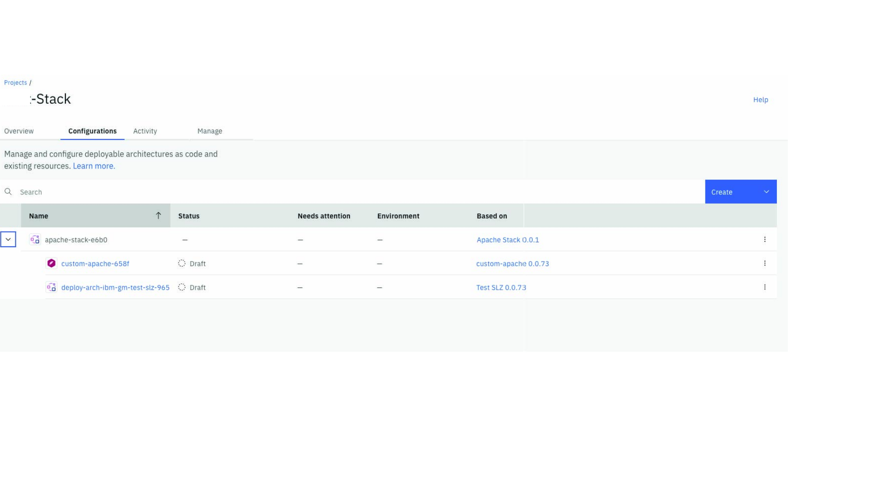

# Stack Sandbox repo

As we evolve the implementation of stacks, this repo represent a formal Stack repo keeping the versio of a stack and its packaged artifacts pedigree.  
Master branch will hold the latest definitions of what a stack repo looks like.

This Specifc stack is based on two staging published DAs, a _slimed_ down SLZ that can be provisioned on stating, and a DA with a VSI/Script installing an Apache server on that SLZ.

Fig. 1: Two DA stack

>  The stack definition syntax is not formal and is most likely to change ... 
